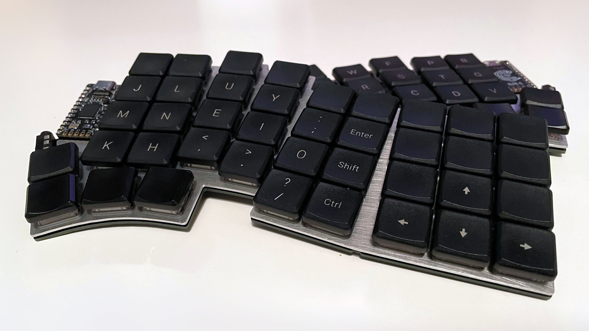
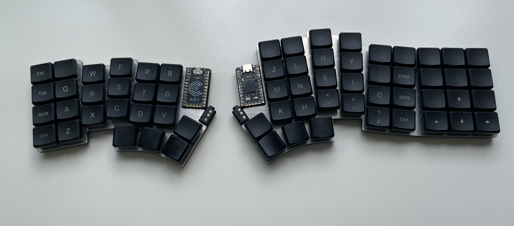
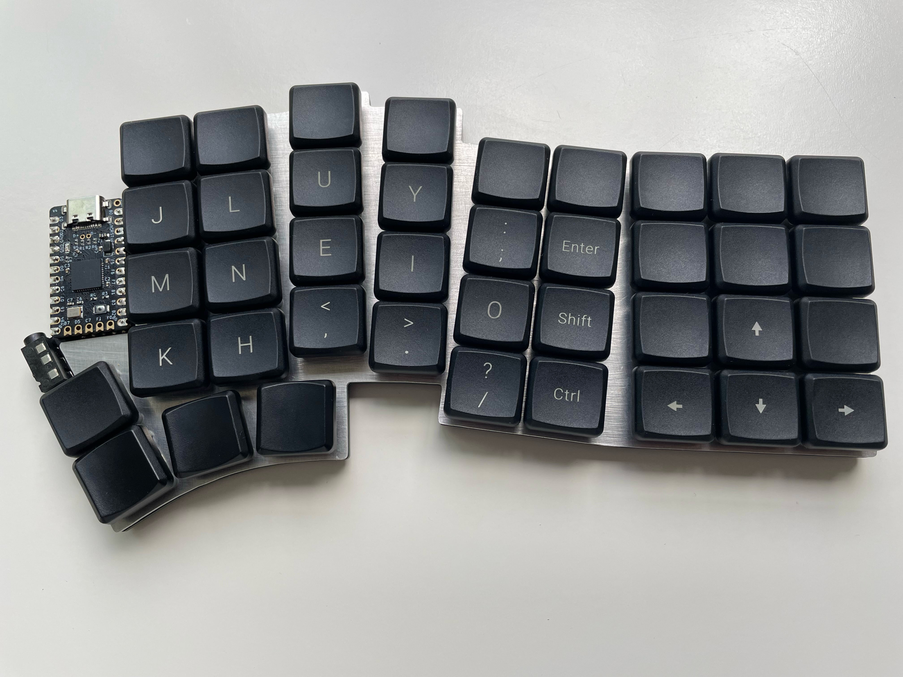
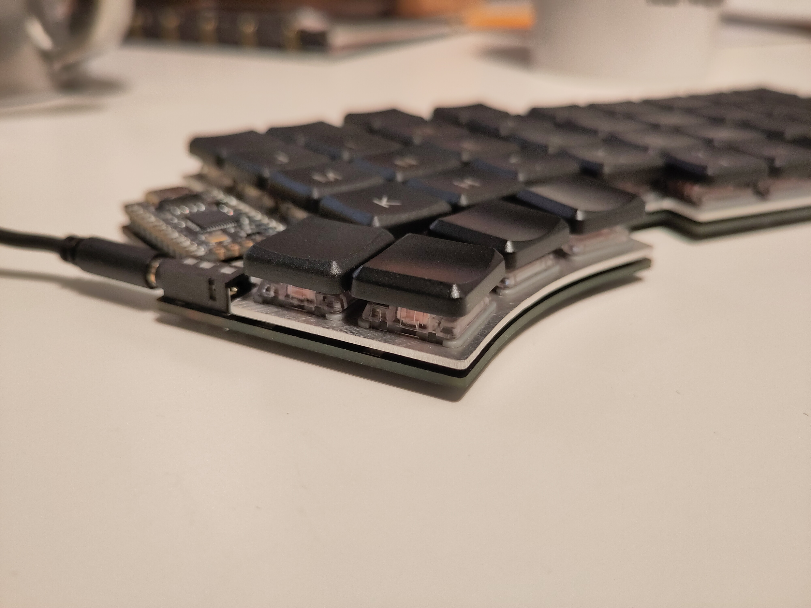
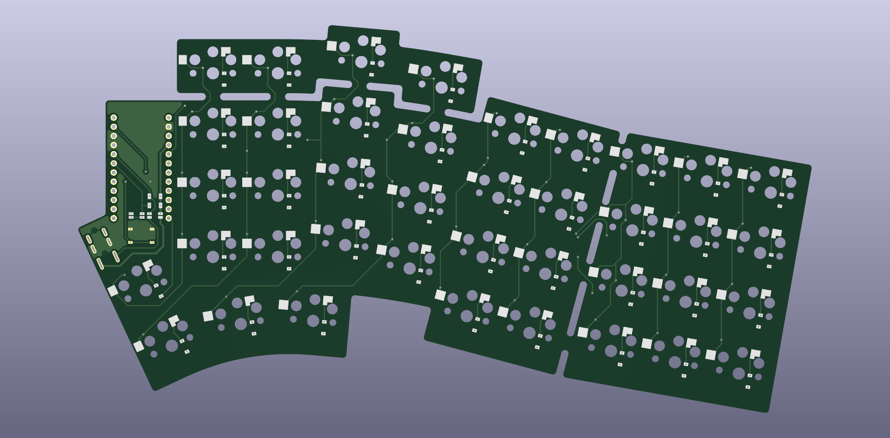

# articulation80

The _articulation80_ keyboard is a split keyboard with 4x9 column splayed keys and 4 thumb keys. The name is inspired from articulated buses, where this keyboard has many connected blocks.



It features:
- Kailh Choc V1 support with choc spacing
- A detachable inner number row with fixed outer number row
- A detachable numpad
- Serial or I2C connection between halves
- Pro Micro-compatible controller support
- Hot-swappable
- No branding! If you are building this, you may want to add silk-screen to make soldering easier.

I took inspiration from many keyboards:
- The general snappable layout from [Breeze](https://www.afternoonlabs.com/breeze/)
- The pinky stagger from [Kyria](https://blog.splitkb.com/introducing-the-kyria/)
- The column splay and thumb cluster from [Hillside 52](https://github.com/mmccoyd/hillside)
- Many popular keyboards to determine a suitable wiring diagram for TRRS, such as the [Corne](https://github.com/foostan/crkbd)

## Repository Contents

| Name | Description |
|:-|:-|
| `pcb` | KiCad 7 project with symbol diagrams, footprints and 3D models included |
| `layout.FCStd` | FreeCad layout file outlining PCB and plate edges |
| `articulation80` | QMK files for firmware |

`scripts/info_json_matrix`

Generates `info.json` layout data for QMK by running `python generate_layout.py layout.csv`. `layout.csv` maps the visual key position with the pin row and column.


`scripts/verify_geometry`

 Translates points generated by FreeCad into KiCad. `export_points.py` is a script intended to run inside FreeCad to export all points into a text file, called `geometry.txt`. `update_geometry_markers.py` uses `geometry.txt` to aid the correct placement of components on the PCB and edges by placing dummy components as markers. Using the snap tool in KiCad, one can construct the edge by connecting markers. `remove_geometry_markers.py` removes these markers. Perhaps there is a more efficient way to make FreeCad and KiCad work together with existing plugins.

After soldering, copy the `articulation80` sub-directory into `qmk_firmware/keyboards`. Flash with:
```
qmk flash -kb articulation80 -km default -bl dfu-split-left
```
Replace `left` with `right` as necessary. This command assumes the Elite-C has been soldered using I2C. If not, change the bootloader in the command and in the `info.json` file.

## Build Instructions

This build is very similar to existing keyboards. Please refer to the inspired keyboards for full instructions.

### Build Parts

| Name | Count | Remarks |
|:-|:-|:-|
| PCB                   | 2      | |
| Plate                 | 2 | Ensure left and right are cut as required |
| Controller            | 2      | A Pro Micro-compatible controller |
| TRRS jack             | 2      | PJ-320A, ensure pins are through-hole|
| TRRS cable            | 1      | Also called a 4-pin 3.5mm audio auxiliary cable |
| Reset button          | 2      | Optional, PTS526 SM15 SMTR2 LFS recommended|
| Resistors             | 2      | Optional, for I2C connection, RC1206FR-074K7 |
| Diode                 | 80*    | SMD only, 1N4148W-TP, SOD-123 recommended |
| Hot swap key sockets | 80*      | CPG135001S30 |
| Key Switch            | 80*    | |
| Key Cap               | 80*    | Ideally 6 key caps for thumbs |
| Hot swap controller sockets | 4      | Optional, 315-43-112-41-003000 or higher profile.|
| Hot swap pins         | 48     | Optional, 3320-0-00-15-00-00-03-0 |
| Rubber feet           | 12     | Can have more for stability, 6 recommended minimum for each side. SJ-5302 CLEAR recommended. |

*Adjust for number of keys desired.

See the [documentation on QMK](https://github.com/qmk/qmk_firmware/blob/master/docs/feature_split_keyboard.md) for how to solder the resistors. To minimise the complexity of the PCB, the left side controller is soldered upside down. There are four pads which connect the controller to the TRRS jack, these are intended to be soldered on the back side of the keyboard. From left to right with the back side facing up, if using serial connection, solder pads 1 and 4, otherwise if using I2C, solder 2, 3 and 4.

## More Images

Featuring MBK and MCC POM keycaps.





